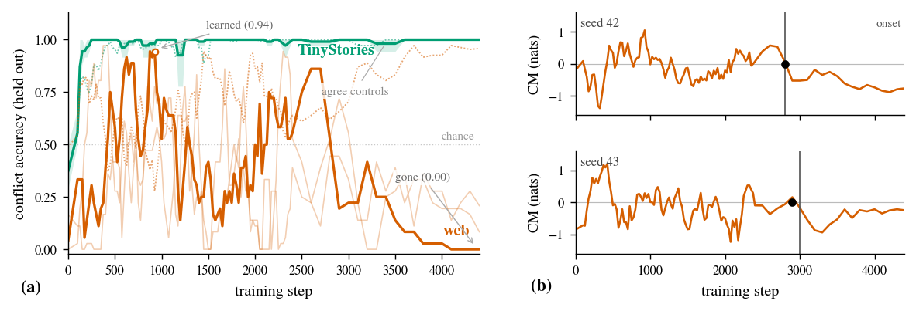
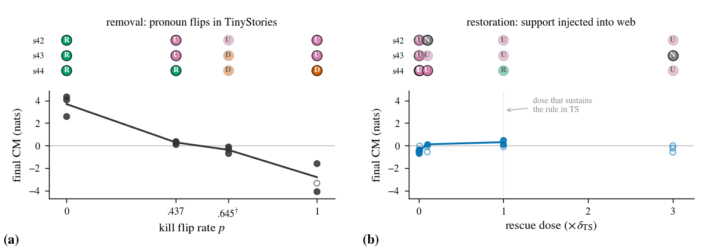

# Natural Ungrokking

Code for the paper **"Natural Ungrokking: Asymmetric Control of Which
Rules Survive Pretraining"** (Li & Sreedhar, 2026).

Paper: [arXiv:2606.26050](https://arxiv.org/abs/2606.26050) · Foundations of
Deep Generative Models (FoGen) Workshop at ICML 2026

Midway through pretraining, small language models learn linguistic
rules and then lose them, with no trace in the loss curve. This repo
contains everything needed to reproduce the experiments: training,
probe batteries, mechanism instruments, corpus-edit interventions
(kill and rescue), the public-checkpoint suite, and the figure and
table generators. Every threshold and prediction was pre-registered
(`prereg/PREREGISTRATION.md`) before the outcome data existed.

## A capability emerges, then collapses



**Figure 1.** The pronoun-gender rule (cued with a girl's name, resolve the
next pronoun to *she*) under web pretraining. **(a)** Held-out accuracy on
*conflict* probes — where the rule and the corpus-wide prior disagree — rises
to 0.94 by step 925, then collapses to chance by the end of the *same* run; the
*agree-condition control* (dotted) keeps climbing, so the construction stays
solved and only the rule is lost. On TinyStories (green) the rule survives at
ceiling. **(b)** An internal contrast margin — the model's preference for the
rule over the surface default — crosses zero exactly at the behavioral collapse.

*Implication:* a capability present at a mid-training checkpoint may not survive
to the final model, and the failure leaves no mark on the loss curve — yet it is
predictable from a single internal order parameter.

## The control is asymmetric: cheap to destroy, hard to restore



**Figure 4.** A registered, two-directional causal test of the support-frequency
law. **(a) Removal:** flipping a rule's supporting evidence into counter-evidence
(token counts fixed) destroys it with strictly monotone dose-response. **(b)
Restoration:** injecting support back into a collapsed corpus never produces a
control-valid recovery, even at three times the dose that sustains the rule
elsewhere (rule:prior ratios over 450× the sustaining level); the margin moves
only weakly.

*Implication:* retention is causally controllable but one-sided — data filtering
or a continual-pretraining mixture shift can silently and near-irreversibly
ungrok a capability the base model had, without deleting a single supporting
example.

## Layout

```
src/fogen/          installable package
  training/         4-layer decoder training loop (python -m fogen.training.train)
  probes/           rule-vs-prior forced-choice probe batteries (rvp)
  evals/            bits-per-byte, probe scoring, public-checkpoint suite
  analysis/         support-frequency counting, phase classification
  theory/           critical-frequency model
  crosscoders/ llc/ mechanism instruments (model diffing, refined LLC)
scripts/            every experiment, evaluator, figure, and table;
                    eval_*.py scripts apply the frozen registered checks
configs/            single source of truth for all hyperparameters
prereg/             the frozen pre-registration document
data/               probe items, tokenizer assets, smoke-test corpus
infra/skypilot/     job templates used for the training grid
analysis/           corpus frequency counts
```

## Install

```
pip install -e .
pytest src scripts          # unit tests live next to the code
```

## Reproduce

Each stage reads configs and prior-stage artifacts; nothing is
hand-entered downstream.

1. **Corpora** — `scripts/prepare_tinystories.py`,
   `scripts/prepare_climbmix.py` (deterministic, seed 0).
2. **Train a grid cell** —
   `python -m fogen.training.train --config configs/web_packed.yaml --seed 42`
   (cells: `{v1_repro, ts_packed_armB, databudget_*, web_*}`, seeds 42-44).
3. **Probes and margins** — checkpoint scoring with the frozen rvp3.1
   battery (`scripts/score_ckpts.py`) and the contrast-margin
   instrument (`scripts/mech_margins.py`).
4. **Interventions** — kill: `scripts/build_kill_shards.py`,
   `scripts/build_an_kill_shards.py`; rescue:
   `scripts/gen_rescue_docs.py`; orchestrated by
   `scripts/step6_run_node.sh` and `scripts/step6t_run_node.sh`.
5. **Registered verdicts** — `scripts/eval_m4.py`,
   `scripts/eval_step6.py`, `scripts/eval_step6t.py`,
   `scripts/eval_predictions.py` emit the pass/fail/void scoreboard.
6. **Public checkpoints** — `scripts/eval_public_suite.py` scores
   Pythia and OLMo with the same frozen probes.
7. **Figures and tables** — `scripts/fig_*.py` and
   `scripts/make_paper_tables.py` read only the artifacts above.

Training run artifacts (checkpoints, probe logs, evaluator outputs)
are not stored in this repository; an archived bundle is linked from
the paper.

## Citation

```bibtex
@article{li2026naturalungrokking,
  title  = {Natural Ungrokking: Asymmetric Control of Which Rules
            Survive Pretraining},
  author = {Li, Juliana and Sreedhar, Diya},
  journal= {arXiv preprint arXiv:2606.26050},
  year   = {2026}
}
```
