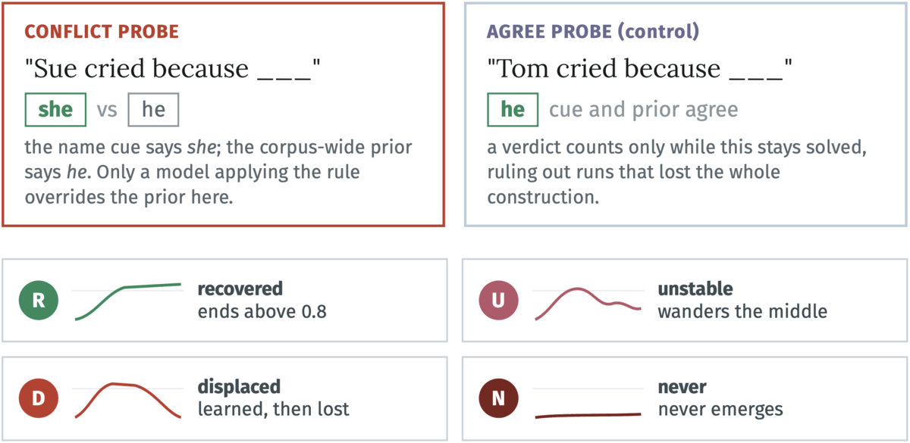

# Natural Ungrokking

Code for the paper **"Natural Ungrokking: Asymmetric Control of Which
Rules Survive Pretraining"** (Li & Sreedhar, 2026).

Paper: [arXiv:2606.26050](https://arxiv.org/abs/2606.26050) · Foundations of
Deep Generative Models (FoGen) Workshop at ICML 2026. A copy of the paper is
included here as `ICML_FoGen_Transient_Cap.pdf`.

Midway through pretraining, small language models learn linguistic rules and
then lose them, with no trace in the loss curve. This repo contains everything
needed to reproduce the experiments: training, probe batteries, mechanism
instruments, corpus-edit interventions (kill and rescue), the public-checkpoint
suite, and the figure and table generators. Every threshold and prediction was
pre-registered (`prereg/PREREGISTRATION.md`) before the outcome data existed.

## A capability emerges, then collapses

<p align="center">
  
</p>

**Figure 1.** The pronoun-gender rule (cued with a girl's name, resolve the
next pronoun to *she*) under web pretraining. **(a)** Held-out accuracy on
*conflict* probes, where the rule and the corpus-wide prior disagree, rises to
0.94 by step 925, then collapses to chance by the end of the same run. The
*agree-condition control* (dotted) keeps climbing, so the construction stays
solved and only the rule is lost. On TinyStories (green) the rule survives at
ceiling. **(b)** An internal contrast margin, the model's preference for the
rule over the surface default, crosses zero at the step where behavior
collapses.

A capability present at a mid-training checkpoint may not survive to the final
model, and the failure leaves no mark on the loss curve. It is predictable from
a single internal order parameter.

## How we measure it

We study one corpus statistic, **support frequency**: how often the stream shows
the rule winning (*she* within 16 tokens of a feminine cue), counted by a
procedure frozen before any result was read. On TinyStories the rule beats the
prior 7.9 to 1 and survives in all nine runs; on filtered web it beats the prior
0.46 to 1 and dies in all nine.

Every capability is probed two ways. The **conflict probe** ("Sue cried because
\_\_\_") pits the name cue against the corpus-wide prior, so only a model applying
the rule answers *she*. The **agree probe** ("Tom cried because \_\_\_") is a
control where cue and prior point the same way; a rule verdict counts only while
this stays solved, which rules out runs that lost the whole construction. The
**contrast margin** CM = log p(*she* | x) − log p(*he* | x) reads the model's
preference at the prediction site, averaged over frozen prompts. A frozen
classifier then reads each conflict trajectory and labels the run **recovered**,
**unstable**, **displaced**, or **never**, so a verdict never rests on a single
eyeballed curve.

<p align="center">
  
</p>

The collapse works like a race between the two continuations. Both the rule and
the prior grow stronger over training, but the corpus supports the prior far more
often, so it pulls ahead at the same step the behavior collapses. The contrast
margin crosses zero within 100 steps of that collapse in every web seed where the
control held. The agree probes stay solved the whole time, so the rule is being
outcompeted at the prediction site rather than the construction breaking.

## Removing a rule is easy, adding it back is not

We tested the support-frequency law in both directions, with the thresholds set
in advance. Turning a rule's supporting evidence into counter-evidence, while
keeping token counts fixed, kills the rule: the more evidence we flip, the deeper
the collapse. The same pattern shows up for a second rule, the *a*/*an* ladder.

Adding support back does not undo the damage. Injecting support into a collapsed
corpus fails to bring the rule back even at three times the dose that keeps it
alive elsewhere, and even when the rule outweighs the prior by more than 450 to
one. The margin hardly moves.

The effect runs one way. A data-filtering step or a change in the pretraining
mixture can remove a capability the base model already had, without deleting a
single example that supports it, and putting the evidence back will not return
it.

## Layout

```
src/fogen/          installable package
  training/         4-layer decoder training loop (python -m fogen.training.train)
  probes/           rule-vs-prior forced-choice probe batteries (rvp)
  evals/            bits-per-byte, probe scoring, public-checkpoint suite
  analysis/         support-frequency counting, phase classification
  theory/           critical-frequency model
  crosscoders/ llc/ mechanism instruments (model diffing, refined LLC)
scripts/            every experiment, evaluator, figure, and table;
                    eval_*.py scripts apply the frozen registered checks
configs/            single source of truth for all hyperparameters
prereg/             the frozen pre-registration document
data/               probe items, tokenizer assets, smoke-test corpus
infra/skypilot/     job templates used for the training grid
analysis/           corpus frequency counts
```

## Install

```
pip install -e .
pytest src scripts          # unit tests live next to the code
```

## Reproduce

Each stage reads configs and prior-stage artifacts; nothing is
hand-entered downstream.

1. **Corpora.** `scripts/prepare_tinystories.py`,
   `scripts/prepare_climbmix.py` (deterministic, seed 0).
2. **Train a grid cell.**
   `python -m fogen.training.train --config configs/web_packed.yaml --seed 42`
   (cells: `{v1_repro, ts_packed_armB, databudget_*, web_*}`, seeds 42-44).
3. **Probes and margins.** Checkpoint scoring with the frozen rvp3.1
   battery and the contrast-margin instrument
   (`scripts/mech_margins.py`).
4. **Interventions.** Kill: `scripts/build_kill_shards.py`,
   `scripts/build_an_kill_shards.py`. Rescue:
   `scripts/gen_rescue_docs.py`.
5. **Registered verdicts.** `scripts/eval_m4.py`,
   `scripts/eval_step6.py`, `scripts/eval_step6t.py`,
   `scripts/eval_predictions.py` emit the pass/fail/void scoreboard.
6. **Public checkpoints.** `scripts/eval_public_suite.py` scores
   Pythia and OLMo with the same frozen probes.
7. **Figures and tables.** `scripts/fig_*.py` and
   `scripts/make_paper_tables.py` read only the artifacts above.

Training run artifacts (checkpoints, probe logs, evaluator outputs)
are not stored in this repository; an archived bundle is linked from
the paper.

## Citation

```bibtex
@article{li2026naturalungrokking,
  title  = {Natural Ungrokking: Asymmetric Control of Which Rules
            Survive Pretraining},
  author = {Li, Juliana and Sreedhar, Diya},
  journal= {arXiv preprint arXiv:2606.26050},
  year   = {2026}
}
```
